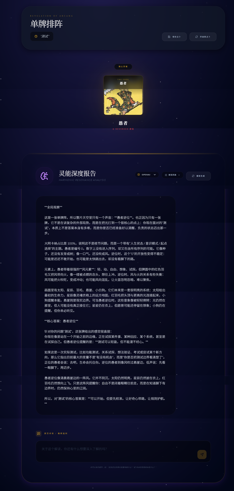

# Lumina Tarot ✨

> 78 张塔罗牌学习 + 多模型 AI 深度解读，开启与潜意识的对话。



## 核心功能

### 🎴 塔罗卡牌学习

- 收录完整的 78 张塔罗牌（大阿卡纳 + 小阿卡纳），逐张讲解牌意、象征与关键词。
- 涵盖正位与逆位含义，帮助你从零建立对塔罗体系的理解。
- 提供符号解读页面，深入了解每张牌背后的意象与文化背景。

### 🔮 AI 解读

- 选择牌阵与问题，抽牌后由 AI 生成围绕你的提问的个性化深度解读。
- 支持多种 AI 大模型自由切换：**DeepSeek（默认）、Kimi、通义千问、Claude、OpenAI**。
- 可选择不同解读风格（自然、神秘、心理、直白、诗意、赛博）。
- 解读后可继续对话追问，历史占卜随时回顾。

## 本地运行

**前置要求：** Node.js

```bash
npm install
# 在 .env.local 中配置所需模型的 API Key
npm run dev
```

## 技术栈

React 19 + TypeScript + Vite · React Router · Tailwind CSS · Framer Motion · 多 AI 大模型代理层
